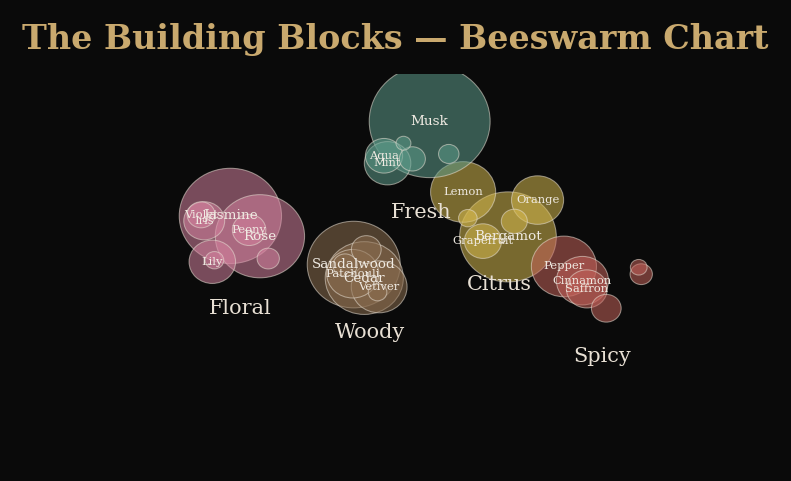
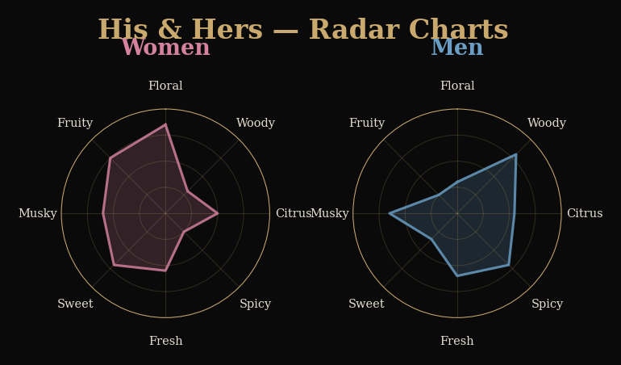
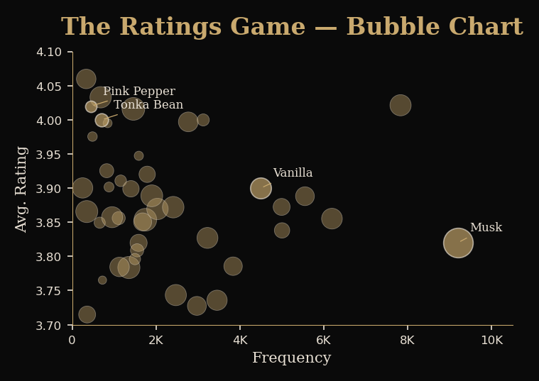
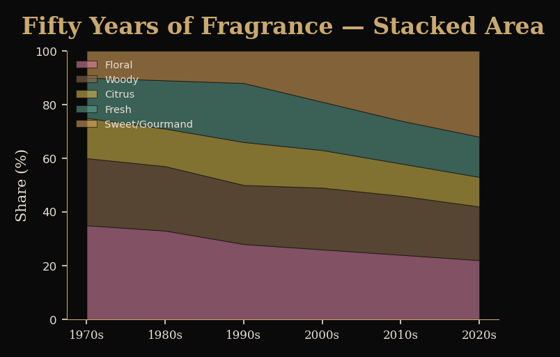
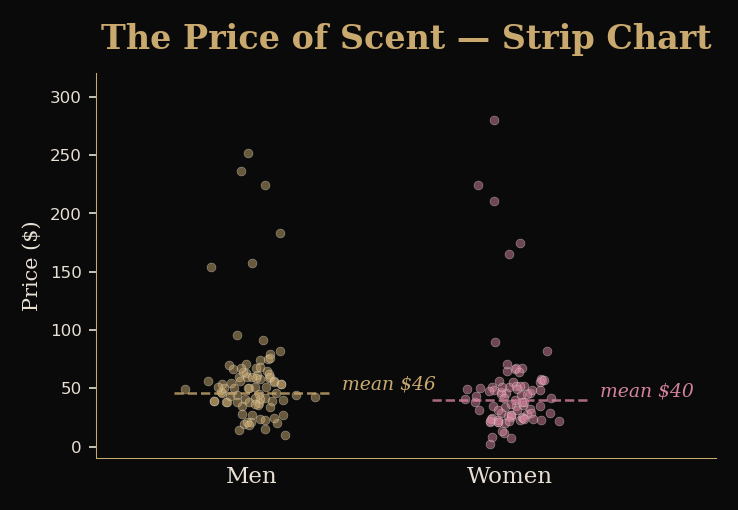

# Milestone 2: The Anatomy of Scent

**COM-480 Data Visualization** | Alexandre Mourot (346365), Gaël Conde Losada (329871)

## Project Goal

We want to understand what makes a perfume work. Not from a chemistry standpoint, but from a data one: what notes show up most often, do popular notes actually get good ratings, how do men's and women's perfumes really differ in composition, and how has all of this changed over the past fifty years. We have two datasets for this. The main one is from Fragrantica (about 24,000 perfumes with detailed note breakdowns, user ratings, accords, gender labels and release years). The second is an eBay pricing dataset with roughly 2,000 listings that lets us bring in a market angle.

The format we picked is a scrollytelling website. Each section covers one question through one visualization, and the reader just scrolls through. No clicking around dashboards or toggling filters. We are going for a dark, luxury aesthetic with gold accents and Cormorant Garamond as the heading font because the subject calls for it. The goal is something closer to a long form magazine piece than a typical data project.

## Visualization Sketches

We have five main sections planned. Here is what each one does and what it should roughly look like.

**Section 1: "The Building Blocks" (Beeswarm Chart).** A constellation of bubbles where each one is a fragrance note, sized by how often it appears in the dataset. They cluster by note family (floral, woody, citrus, spicy, fresh, sweet). Musk alone shows up in over 11,000 perfumes. Pink pepper, on the other hand, barely reaches a few hundred. On hover you get the count and the top brands using that note. We took some inspiration from the "Fragrance of Data" project that got recognition at the Information is Beautiful Awards.

**Section 2: "His & Hers" (Radar Charts).** Two radar charts placed side by side, one for women's perfumes, one for men's. Eight axes, one per note family. From our EDA we know jasmine and rose dominate women's compositions while patchouli and cedar lean masculine. But musk and bergamot are pretty much everywhere regardless of gender. A toggle lets the reader add a unisex overlay as a third layer.

**Section 3: "The Ratings Game" (Bubble Chart).** Frequency on the x axis, average user rating on the y axis. Bubble size encodes how many perfumes contain each note. What we found interesting in the EDA is that being common does not mean being loved. Tonka bean and pink pepper both have high average ratings despite appearing in far fewer perfumes, while musk is everywhere but sits around the mean.

**Section 4: "Fifty Years of Fragrance" (Stacked Area Chart).** Note family proportions by decade from the 1970s through the 2020s. The reader scrolls forward through time and watches the composition landscape shift. Clean fresh notes take over in the 90s, gourmand ingredients explode in the 2010s, oud keeps gaining ground. We need to bin the data by decade and normalize within each period.

**Section 5: "The Price of Scent" (Strip Chart).** A beeswarm strip plot of eBay prices split by gender. Men's listings go from $3 to $259 (mean around $46), women's from $2 to $300 (mean around $40). The hard part here is linking eBay listings to Fragrantica entries because naming conventions are all over the place. We plan to use fuzzy matching on brand names, but this is still experimental.

Beyond the five main sections, we have a few more ideas we would like to explore if time allows.

A **chord diagram** showing which notes tend to co-occur across perfumes. The 15 or so most common notes would form the outer ring, and the arcs between them would encode how often two notes appear together in the same composition. This could reveal some non-obvious pairings that perfumers rely on but consumers never think about.

A **Sankey diagram** tracing the flow from top notes through middle notes down to base notes. Perfumes have a layered structure (what you smell first, what develops over time, what lingers) and we think a Sankey would be a great way to show the most common "recipes" or compositional paths.

An **interactive heatmap of accords by gender**. The Fragrantica dataset has five accord fields per perfume (woody, floral, fresh, sweet, citrus, etc.) and we could build a heatmap with accords as rows, gender categories as columns, and color intensity encoding frequency. Adding interactive sorting (by total frequency, by gender skew) and maybe an expandable detail panel when you click a row would let the reader really dig into the data. This one is ambitious but the accord data is already structured in the dataset so the preprocessing would be straightforward.

We could also think about a **"Deep Dive" section** at the end that groups some of these exploratory visualizations (chord, Sankey, heatmap) together as a set of interactive cards the reader can pick from, rather than forcing a linear scroll through all of them. This way the main narrative stays tight (sections 1 through 5) and the deep dive is there for people who want to explore further on their own.

## Tools and Lectures

| Visualization | Main tool | Relevant lectures |
|---|---|---|
| Beeswarm | D3.js force simulation | D3.js, Interactions |
| Radar charts | D3.js radial scales + SVG | Perception of colors, Marks and Channels |
| Bubble chart | D3.js scatterplot | Data, Marks and Channels |
| Stacked area | D3.js stack + area generator | Data, Interactive D3 |
| Price strip chart | D3.js force jitter | Data, Interactions |
| Chord diagram | D3.js chord layout | Perception of colors, Interactive D3 |
| Sankey diagram | D3.js + d3-sankey | Marks and Channels, Designing viz |
| Accord heatmap | D3.js color scales + grid | Data, Perception of colors |
| Scroll framework | Scrollama (IntersectionObserver) | Designing viz, Do and dont in viz |
| Data preprocessing | Python + pandas | n/a |
| Hosting | GitHub Pages | n/a |

Everything is vanilla HTML/CSS/JS, no framework, no build step. Scrollama handles the scroll triggered transitions through the IntersectionObserver API. Smooth scrolling uses Lenis. Data is preprocessed in Python with pandas and served as static JSON.

## Implementation Breakdown

### Core

The story needs to work with just the scrollytelling skeleton, the beeswarm (section 1), the radar (section 2), and the bubble chart (section 3). These three together already answer the main questions: what notes exist, how genders differ, and whether common notes are actually well rated. Add hover tooltips, smooth transitions and a gender filter toggle and we have a complete product. Everything else builds on top of this.

### Stretch goals

The stacked area chart (section 4) would add a historical dimension that makes the story richer. The price strip chart (section 5) is interesting but its quality depends entirely on how well we can match the two datasets, so we are not committing to it yet. After those, a chord diagram and a Sankey diagram would bring visual depth by showing how notes connect to each other and flow through the three layers of a perfume. We are also quite excited about the accord heatmap idea because it would give the reader a completely different lens on the data, looking at higher level scent profiles rather than individual notes, and the interactive sorting could make it genuinely useful for someone trying to understand what separates a "woody oriental" from a "floral aquatic." If we manage to build all of these, a deep dive section grouping them as interactive cards at the end of the site would be a clean way to keep the main story focused while still offering exploration. Last, a perfume search feature where you type a name and see its profile highlighted across all the visualizations would be a nice touch if we get to it.

## Functional Prototype

The current prototype is running at **https://com-480-dataviz.vercel.app**. It has the scrollytelling skeleton with section navigation, the dark theme with gold accents, and the first two core visualizations (beeswarm and radar) in interactive form. The other sections show placeholder containers that we will fill as we go.
